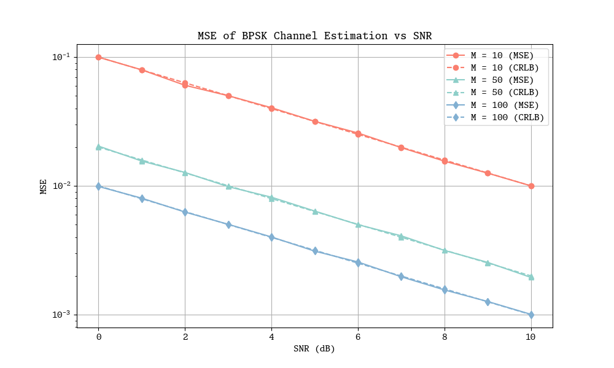
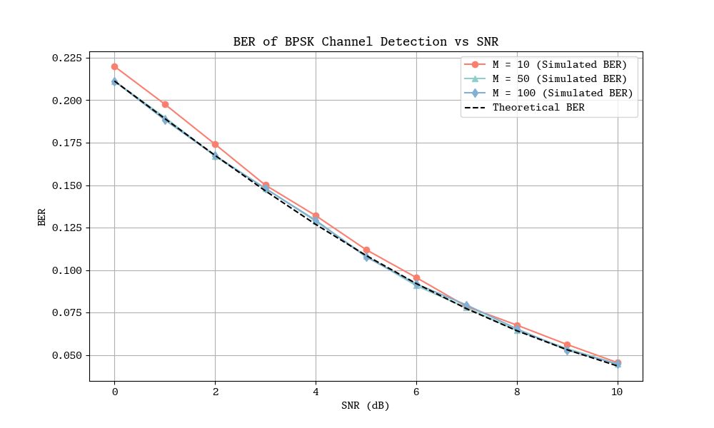

# 最大似然估计

> 衰落系数的最大似然估计公式推导

最小二乘法是通过最小化误差的平方和来估计参数的统计方法。以下是推导过程，以估计信道系数 $h$ 为例：

### 1. 问题描述

我们有如下的信道模型：

$x_k = h \cdot s_k + n_k$

其中：
- $x_k$ 是接收信号。
- $s_k$ 是已知的发送信号。
- $h$ 是我们需要估计的信道系数。
- $n_k$ 是均值为零的高斯噪声。

### 2. 最小化误差平方和
为了估计 $h$，我们最小化接收信号 $x_k$ 和估计信号 $\hat{x}_k$ 之间的误差平方和：

$\text{误差平方和} = \sum_{k=1}^{N} (x_k - \hat{x}_k)^2 = \sum_{k=1}^{N} (x_k - h \cdot s_k)^2$

### 3. 导数设为零
为了找到使误差平方和最小的 $h$，我们对误差平方和关于 $h$ 求导，并将其设为零：

$\frac{\partial}{\partial h} \sum_{k=1}^{N} (x_k - h \cdot s_k)^2 = 0$

### 4. 展开求导
首先展开误差平方和：

$\sum_{k=1}^{N} (x_k - h \cdot s_k)^2 = \sum_{k=1}^{N} (x_k^2 - 2h \cdot s_k \cdot x_k + h^2 \cdot s_k^2)$

然后对 \( $h$ \) 求导：

$\frac{\partial}{\partial h} \sum_{k=1}^{N} (x_k^2 - 2h \cdot s_k \cdot x_k + h^2 \cdot s_k^2) = \sum_{k=1}^{N} (-2 s_k \cdot x_k + 2 h \cdot s_k^2)$

### 5. 设导数为零
将导数设为零：

$\sum_{k=1}^{N} (-2 s_k \cdot x_k + 2 h \cdot s_k^2) = 0$

### 6. 求解 $h$
解方程得到 \( $h$ \)：

$-2 \sum_{k=1}^{N} s_k \cdot x_k + 2 h \sum_{k=1}^{N} s_k^2 = 0$
$\sum_{k=1}^{N} s_k \cdot x_k = h \sum_{k=1}^{N} s_k^2$
$h = \frac{\sum_{k=1}^{N} s_k \cdot x_k}{\sum_{k=1}^{N} s_k^2}$

由此推导出我们在代码中使用的最小二乘估计公式：

$\hat{h} = \frac{\sum s_k \cdot x_k}{\sum s_k^2}$

这个公式表示信道系数 $h$ 的最大似然估计，通过发送信号 $s_k$ 和接收信号 $x_k$ 的内积除以发送信号的平方和来计算。

# 衰落系数克拉美罗界推导

### 1. 克拉美罗界（CRLB）概述

克拉美罗界提供了估计参数方差的下界，对于任何无偏估计量 $\hat{h}$ ，其方差满足：

$\text{Var}(\hat{h}) \geq \frac{1}{I(h)}$

其中， $I(h)$ 是 $h$ 的费舍尔信息（Fisher Information）。

### 2. 费舍尔信息的计算

费舍尔信息定义为：

$I(h) = - \mathbb{E} \left[ \frac{\partial^2 \ln p(x; h)}{\partial h^2} \right]$

其中， $p(x; h)$ 是接收信号 $x$ 的概率密度函数。

对于给定的 $h$ 和噪声方差 $\sigma_n^2$，接收信号 $x_k = h s_k + n_k$ 的概率密度函数是高斯分布，均值为 $h s_k$，方差为 $\sigma_n^2$：

$p(x_k; h) = \frac{1}{\sqrt{2 \pi \sigma_n^2}} \exp\left( -\frac{(x_k - h s_k)^2}{2 \sigma_n^2} \right)$

为了计算费舍尔信息，我们首先需要计算对数似然函数的二阶导数。

似然函数：

$\mathcal{L}(h) = \prod_{k=1}^N p(x_k; h)$

对数似然函数：

$\ln \mathcal{L}(h) = \sum_{k=1}^N \ln p(x_k; h)$
$= \sum_{k=1}^N \ln \left( \frac{1}{\sqrt{2 \pi \sigma_n^2}} \exp\left( -\frac{(x_k - h s_k)^2}{2 \sigma_n^2} \right) \right)$
$= -\frac{N}{2} \ln (2 \pi \sigma_n^2) - \frac{1}{2 \sigma_n^2} \sum_{k=1}^N (x_k - h s_k)^2$

对数似然函数的二阶导数

首先计算对数似然函数的一阶导数：

$\frac{\partial \ln \mathcal{L}(h) }{\partial h} = \frac{1}{\sigma_n^2} \sum_{k=1}^N (x_k - h s_k) s_k$

然后计算二阶导数：

$\frac{\partial^2 \ln \mathcal{L}(h) }{\partial h^2} = -\frac{1}{\sigma_n^2} \sum_{k=1}^N s_k^2$

由于 $s_k$ 的取值为 $\pm 1$，因此 $s_k^2 = 1$：

$\frac{\partial^2 \ln \mathcal{L}(h)}{\partial h^2} = -\frac{N}{\sigma_n^2}$

### 3. 费舍尔信息

根据费舍尔信息的定义：

$I(h) = - \mathbb{E} \left[ \frac{\partial^2 \ln \mathcal{L}(h)}{\partial h^2} \right]$
$I(h) = \frac{N}{\sigma_n^2}$

### 4. 克拉美罗界

信道系数 $h$ 的方差下界为：

$\text{Var}(\hat{h}) \geq \frac{1}{I(h)} = \frac{\sigma_n^2}{N}$

### 5. 结论

通过以上推导，得出 BPSK 系统中信道估计的克拉美罗界（CRLB）为：

$\text{Var}(\hat{h}) \geq \frac{\sigma_n^2}{N}$

这意味着在 BPSK 调制系统中，信道估计的方差下界与噪声方差成正比，并且与观测样本数量成反比。

# 比特错误概率的理论值

### 1. 问题描述
对于 BPSK 调制，接收信号模型为：

$x_k = h s_k + n_k$

其中：
- $s_k$ 是发送信号，取值为 $\pm 1$
- $h$ 是信道系数
- $n_k$ 是高斯白噪声，均值为 0，方差为 $\sigma_n^2$

### 2. 接收信号检测
接收信号经过相干检测得到估计信号：

$\hat{s}_k = \text{sign}(x_k) = \text{sign}(h s_k + n_k)$

### 3. 比特错误概率

对于 BPSK 调制，误码率 $P_b$ 是接收到的信号与发送信号不一致的概率。假设发送信号 $s_k$ 为 +1（对于 -1 的情况推导类似），我们需要计算接收信号为 -1 的概率，即 $x_k < 0$ 的概率。

$P_b = P(x_k < 0 | s_k = 1)$

由于 $x_k = h s_k + n_k$，并且 $s_k = 1$ 时：

$P_b = P(h + n_k < 0)$
$= P(n_k < -h)$

因为 $n_k$ 是均值为0，方差为 $\sigma_n^2$ 的高斯分布：

$P_b = P\left(\frac{n_k}{\sigma_n} < \frac{-h}{\sigma_n}\right)$

其中， $\frac{n_k}{\sigma_n}$ 是标准正态分布 $N(0,1)$ ：

$P_b = \Phi\left(\frac{-h}{\sigma_n}\right)$

由于 $Q(x) = 1 - \Phi(x)$，其中 $\Phi(x)$ 是标准正态分布的累积分布函数：

$P_b = Q\left(\frac{h}{\sigma_n}\right)$

这个结果说明，对于给定信道系数 $h$ 和噪声方差 $\sigma_n^2$ 的情况下，比特错误概率为：

$P_b = Q\left(\frac{|h|}{\sigma_n}\right)$

### 4. 平均信道条件下的 BER

在实际系统中，信道系数 $h$ 可能不是固定的，而是一个随机变量。假设信道系数 $h$ 服从 Rayleigh 分布，其概率密度函数为：

$f_h(h) = \frac{h}{\sigma_h^2} \exp\left(-\frac{h^2}{2\sigma_h^2}\right)$

其中 $\sigma_h^2$ 是信道系数的方差。此时，我们需要计算在 Rayleigh 衰落信道条件下的平均比特错误率（BER）：

$\text{BER} = \int_0^\infty P_b f_h(h) dh$
$\text{BER} = \int_0^\infty Q\left(\frac{h}{\sigma_n}\right) \frac{h}{\sigma_h^2} \exp\left(-\frac{h^2}{2\sigma_h^2}\right) dh$

### 5. 积分计算

我们可以通过求解这个积分来得到平均比特错误率。使用已知的公式，结果是：

$\text{BER} = \frac{1}{2} \left(1 - \sqrt{\frac{\text{SNR}}{1 + \text{SNR}}}\right)$

其中，信噪比（SNR）定义为：

$\text{SNR} = \frac{\sigma_h^2}{\sigma_n^2}$

这个公式通过复杂的积分推导得出，但我们可以直接引用其结果。

### 结论

通过上述推导，我们得到了在指定信道条件下的 BPSK 系统的比特错误率（BER）：

$P_b = Q\left(\frac{|h|}{\sigma_n}\right)$

在 Rayleigh 衰落信道条件下，平均比特错误率为：

$\text{BER} = \frac{1}{2} \left(1 - \sqrt{\frac{\text{SNR}}{1 + \text{SNR}}}\right)$

# Simulation

MSE 曲线分析：

1. SNR 一定时，导频头长度（M）越长，MSE 越低，随着导频头长度的增加，MSE 显著降低。这是因为更长的导频头序列能够提供更多的观测数据，提高信道估计的准确性。
2. 导频头长度（M）一定时，MSE 随 SNR 增加而降低，随着 SNR 的增加，MSE逐渐降低。这是因为更高的 SNR 意味着噪声影响较小，从而提高了信道估计的准确度。
3. 随着 M 值的增大（从 10 到 100），仿真 MSE 与理论 MSE 之间的差距在减小，这表明增加导频序列长度 M 有助于改善信道估计的精度。

BER 曲线分析：

1. SNR 一定时，导频头长度（M）越长，BER 越低：类似于 MSE，随着导频头长度的增加，BER 降低。这是因为更长的导频头序列提高了信道估计的准确性，从而减少了解调错误。
2. 导频头长度（M）一定时，BER 随 SNR 增加而降低，随着 SNR 的增加，BER 逐渐降低。这是因为更高的 SNR 意味着噪声干扰较少，信号检测更准确。

# Python Code

```python 
# -*- coding: UTF-8 -*-
"""
@IDE            : VsCode
@Time           : 2024/06/08
@Project        : 信号检测大作业 - 2
@Author         : Kaikai
@Introduction   : 仿真 BPSK 信道估计和检测性能
"""
import numpy as np
import matplotlib.pyplot as plt


def simulate_bpsk_channel(N: int, SNR_dB: int, h: float = None):
    """模拟 BPSK 信道

    Args:
        N (int): 信号长度
        SNR_dB (int): 信噪比
        h (float, optional): 衰落系数. Defaults to None.

    Returns:
        (ndarray[int], ndarray[float], float): 发送信号, 接收信号, 衰落系数
    """
    # 1. 生成发送信号 s_k
    # 若 h 为 None 生成 1010... 导频头
    s_k = (
        np.random.choice([-1, 1], N) if h is not None else np.array([1, -1] * (N // 2))
    )

    # 2. 生成信道衰落系数 h
    h = h if h is not None else np.random.rayleigh(scale=np.sqrt(0.5))

    # 3. 生成噪声
    # 3.1 计算信噪比 (功率表示)
    SNR_linear = 10 ** (SNR_dB / 10)
    # 3.2 计算标准差
    sigma_n = np.sqrt(np.mean(s_k**2) / SNR_linear)
    # 3.3 生成独立同分布的高斯噪声
    n_k = np.random.normal(0, sigma_n, N)

    # 4. 生成接收信号
    x_k = h * s_k + n_k

    return s_k, x_k, h


def estimate_h(s_k: np.ndarray, x_k: np.ndarray):
    """估计信道系数

    Args:
        s_k (ndarray): 发送信号
        x_k (ndarray): 接收信号

    Returns:
        float: 估计的信道系数
    """
    # 最大似然估计：最小化误差平方和
    return np.sum(s_k * x_k) / np.sum(s_k * s_k)


def detect_s(x_k: np.ndarray, h_est: float, s_true: np.ndarray):
    """相干检测

    Args:
        x_k (ndarray): 接收信号
        h_est (float): 估计的信道系数

    Returns:
        int: Bit Error Nums (误比特数目)
    """
    # 1. 估计发送信号
    s_est = np.sign(x_k / h_est)
    s_est[s_est == 0] = 1
    # 2. 统计误比特数目
    return np.sum(s_est != s_true)


def simulate_trials(M, SNR_range_dB, N=1000, num_trials=10000):
    """不同信噪比下的 BPSK 信道估计和性能检测仿真

    Args:
        M (int): 导频头长度
        SNR_range_dB (list[int]): 信噪比范围
        N (int, optional): 相干检测性能仿真信号长度. Defaults to 1000.
        num_trials (int, optional): 统计 MSE 与 BER 时的实验次数. Defaults to 10000.

    Returns:
        (list[float], list[float]): 不同信噪比下信道系数的 MSE 和信道的 BER
    """
    mse = []
    ber = []
    # 计算均方误差 (MSE) 和平均误比特率 (BER)
    for SNR_dB in SNR_range_dB:
        errors = []
        nums = 0
        times = 0
        while times < num_trials and nums < N * num_trials / 10:
            # 1. 借助导频头估计信道系数
            s_k, x_k, h_true = simulate_bpsk_channel(M, SNR_dB)

            h_est = estimate_h(s_k, x_k)
            # 2. 计算衰落系数均方误差
            error = (h_est - h_true) ** 2
            errors.append(error)
            # 3. 相干检测性能仿真
            s_k, x_k, _ = simulate_bpsk_channel(N, SNR_dB, h_true)
            # 4. 统计误比特数目
            nums += detect_s(x_k, h_est, s_k)
            times += 1
        mse.append(np.mean(errors))
        ber.append(nums / (times * N))
    return mse, ber


def calculate_crlb(M, SNR_range_dB):
    """计算不同信噪比下的 CRLB

    Args:
        M (int): 导频头长度
        SNR_range_dB (list[int]): 信噪比范围

    Returns:
        list[float]: 不同信噪比下信道系数的 CRLB
    """
    crlb = []
    for SNR_dB in SNR_range_dB:
        SNR_linear = 10 ** (SNR_dB / 10)
        crlb.append(1 / (M * SNR_linear))
    return crlb


def theoretical_ber(SNR_range_dB, variance_h=1, power_s=1):
    """计算理论 BER

    Args:
        SNR_range_dB (list[int]): 信噪比范围
        variance_h (int, optional): 信道系数的方差. Defaults to 1.
        power_s (int, optional): 发送信号的功率. Defaults to 1.

    Returns:
        list[float]: 不同信噪比下的理论 BER
    """
    SNR_linear = 10 ** (SNR_range_dB / 10)
    variance_n = power_s / SNR_linear
    SNR = variance_h / variance_n
    ber = 0.5 * (1 - np.sqrt(SNR / (1 + SNR)))
    return ber


# 参数定义
M_values = [10, 50, 100]
SNR_range_dB = np.linspace(0, 10, 11)

# 设置图表全局样式
plt.rcParams["figure.figsize"] = (10, 6)
# 设置颜色调色板
# custom_palette = ["#899CCB", "#F1C0C4", "#FBE7C0"]
custom_palette = ["#FA7F6F", "#8ECFC9", "#82B0D2"]
plt.rcParams["axes.prop_cycle"] = plt.cycler(color=custom_palette)
# 选择 monospace 字体
plt.rcParams["font.family"] = "monospace"
plt.rcParams["font.monospace"] = "Monaspace Xenon"
# 图表定义
mse_fig = plt.figure()
ber_fig = plt.figure()
markers = ["o", "^", "d"]

# 仿真不同导频头长度下的性能
for i, M in enumerate(M_values):
    mse, ber = simulate_trials(M, SNR_range_dB)
    crlb = calculate_crlb(M, SNR_range_dB)
    # 绘制图表
    plt.figure(mse_fig.number)
    plt.semilogy()
    plt.plot(
        SNR_range_dB,
        mse,
        label=f"M = {M} (MSE)",
        marker=markers[i],
        color=custom_palette[i],
    )
    plt.plot(
        SNR_range_dB,
        crlb,
        label=f"M = {M} (CRLB)",
        linestyle="--",
        marker=markers[i],
        color=custom_palette[i],
    )
    plt.figure(ber_fig.number)
    plt.plot(
        SNR_range_dB,
        ber,
        label=f"M = {M} (Simulated BER)",
        marker=markers[i],
        color=custom_palette[i],
    )

# 理论 BER
theory_ber = theoretical_ber(SNR_range_dB, variance_h=0.5, power_s=1)
plt.figure(ber_fig.number)
plt.plot(
    SNR_range_dB, theory_ber, label="Theoretical BER", linestyle="--", color="black"
)

# 图表设置
plt.figure(mse_fig.number)
plt.xlabel("SNR (dB)")
plt.ylabel("MSE")
plt.title("MSE of BPSK Channel Estimation vs SNR")
plt.legend()
plt.grid()

plt.figure(ber_fig.number)
plt.xlabel("SNR (dB)")
plt.ylabel("BER")
plt.title("BER of BPSK Channel Detection vs SNR")
plt.legend()
plt.grid()
plt.show()

```