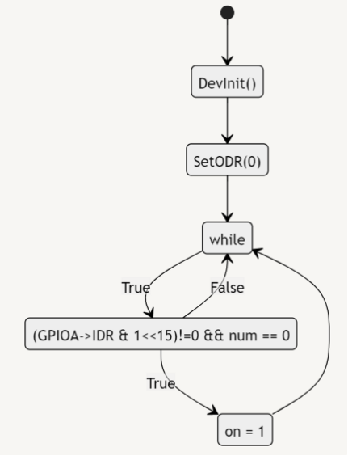

# 微原大作业

# 作业要求

<aside>
💡 使用查询方式查询按键状态，当按键打开时， GPIOA15管脚为“0” ，数码管显示0；当按键闭合时，GPIOA15管脚为“1”，数码管显示自己的学号，每隔1秒显示1位，显示结束后，数码管灯关闭。学号直接定义在数组里。

</aside>

# 代码

# 汇编入口文件

```nasm
AREA RESET,CODE
	EXPORT __Vectors
	EXPORT Reset_Handler
__Vectors
	DCD __initial_sp
	; 异常向量表
	DCD Reset_Handler
	SPACE 39*4
	IMPORT Tim1lsr
	DCD Tim1lsr
	SPACE 11*4

Reset_Handler PROC
	IMPORT main
	ldr r1,=main
	bx r1
	B .
	ENDP	
	
  NOP	
	AREA STACK,DATA
	SPACE 0x100
__initial_sp

	END
```

## C语言代码

```nasm
#include "usrt1.h"

int num = 0;  // 待显示位
int on = 0;  // 标志位

void setODR(int n) {
	int number[10] = {0xC0, 0xF9, 0xA4, 0xB0, 0x99, 0x92, 0x82, 0xF8, 0x80, 0x90};  // 共阳极数码管
	GPIOA->ODR = (number[n] << 8);
}

void DevInit() {
	RCC->APB2ENR=(1<<2)|(1<<11);//PA TIM1使能
	
	// GPIO初始化
	GPIOA->CRH&=0X00000000;
	GPIOA->CRH|=0X43333333;	// 输入输出设置
	
	// 定时器初始化
	TIM1->PSC=7999;
	TIM1->ARR=999;  // 中断频率设置为 1Hz 即周期为 1s
	TIM1->DIER=1;  // 计数更新使能
	TIM1->CR1=0x1;  // 计数使能
	NVIC->ISER[0] = 0x1<<25;  // 外部中断使能
}

void Tim1lsr() {
	int id[11] = {2, 1, 0, 0, 9, 1, 0, 1, 4, 2, 5};  // 学号
	TIM1->SR=0;
	if (on!=0) {  // 按钮已按下时进入
		if (num==11) {
			GPIOA->ODR = (0xFF << 8);
			num = 0;  // 待显示位：重置为首位
			on = 0;  // 标志位：按钮可再次按下
		} else {
			setODR(id[num]);
			num++;  // 待显示位至下一位
		}
	}
}

int main()
{
	DevInit();
	setODR(0);
	while(1){
		if ((GPIOA->IDR & 1<<15)!=0 && num == 0) {
			on = 1; // 标志位：按钮已按下
		}
	}
}
```

# 程序设计框图

## 主程序设计



## 计时器设计

