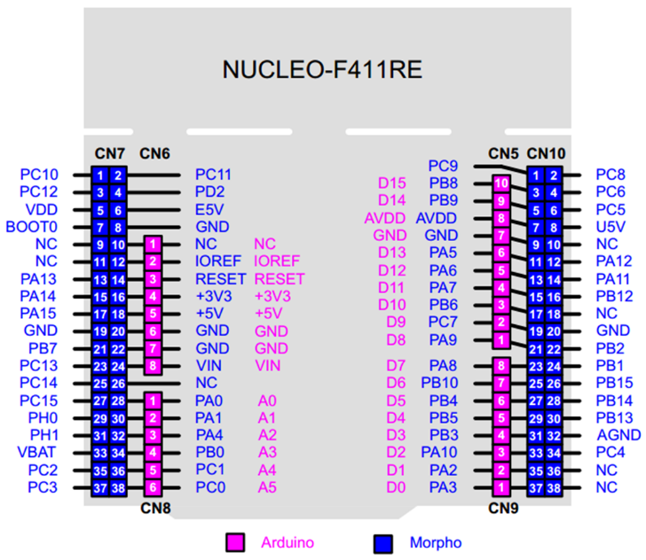

1. SodaFountain: 上位机部分
2. soda-fountain-fe: 官网前端部分

# Resource

[FriendlyThings/zh - FriendlyELEC WiKi](https://wiki.friendlyelec.com/wiki/index.php/FriendlyThings/zh#S5P4418)

[FriendlyThings APIs/zh - FriendlyELEC WiKi](https://wiki.friendlyelec.com/wiki/index.php/FriendlyThings_APIs/zh)

https://github.com/friendlyarm/friendlythings-sdk

[使用Android Studio开发友善之臂Smart4418开发板_哔哩哔哩_bilibili](https://www.bilibili.com/video/av47124198/?spm_id_from=333.788.video.desc.click&vd_source=2bfc367d7fdda55178667b91012ac8f1)

## 新建项目

Android版本：4.0.3 4.4？ 5.1

## 添加硬件接口文件

1. libs → app/libs
2. res → app/src/main/res
3. com → app/src/main/java/com

## 主文件内容调换

以SerialPortDemo为例

1. com/friendlyarm/SerialPortDemo/~.java → com/example.test/MainActivity
2. 修改主类名称为对应文件名
3. 修改UART串口`private String devName = "/dev/ttyAMA3";  *// ! uart3*`
4. 删除com/friendlyarm/SerialPortDemo

## 配置权限

### 为APP添加system权限

in /app/src/main/AndroidMainifest.xml

```xml
<application 
	···
	android:sharedUserId="android.uid.system"
/>
```

### .so文件添加使用权限

in /src/build.gradle

```xml
android {
	···
	sourceSets {
        main {
            jniLibs.srcDirs =  ['libs']
        }
    }
}
```

## 烧录

1. 连平板
2. 检查是否闪退

## 进行签名授权

1. 锤子，make project
2. cd /app/build/outputs/apk/debug
3. 以下三个文件（/Help1）复制至当前路径
    
    ```jsx
    platform.pk8
    platform.x509.pem
    signapk.jar
    ```
    
4. 签名（命令行）
    
    ```powershell
    java -jar .\signapk.jar .\platform.x509.pem .\platform.pk8 .\Serial3.apk（这里是原来生成的未签名的APP） .\Serial1-Signed.apk（已签名的APP，名字随意）
    ```
    
5. 将生成的~-Signed.apk文件烧录
    
    vivo APK安装器
    
    平板中先删除后安装、
    
6. 连电脑上用串口调试助手检查能否通信

## 发信息

```jsx
HardwareControler.write(devfd, str.getBytes())
```

## 收信息

```jsx
HardwareControler.read(devfd, buf, BUFSIZE)
```

# 接口设计

测试流程设计：

测试共包括以下几部分：

1. 串口通信测试
    
    使用 MCU 的1号和6号串口，6号串口与上位机通信，1号串口与电脑的串口调试助手通信。
    
    <aside>
    💡 必须首先用电脑串口调试助手分别测试 mcu 串口 1 号和六号，确保均能正常使用！！
    
    </aside>
    
    流程设计：
    
    - 上位机发送字符 R
    - MCU 接收字符 R，并发送字符 R 至串口调试助手
    - 通过串口调试助手发送字符 1
    - MCU 接收字符 1，并发送 字符 1 至上位机
    
    测试原始记录：
    
    - 串口调试助手成功接收字符 R
    - 上位机成功接收字符 1
    
    测试结果及说明：
    
    - 测试结果表示串口通信正常，测试成功
2. MCU 与 FPGA 通信测试
3. 颜色传感器与距离传感器功能测试
4. 舵机功能测试

## 发信息

```jsx
HardwareControler.write(devfd, str.getBytes())
```

## 收信息

```c
HardwareControler.read(devfd, buf, BUFSIZE)
```

```c
// 这是测试通信用的MCU代码，希望有所帮助

int main(void)
{
	uint8_t value = 'S';
	uint8_t message[4] = {'A', 'B', 'C', 'E',};
	uint8_t drinks[6] = {'1', '2', '3', '4', '5', '6'};

  HAL_Init();

  SystemClock_Config();

  MX_GPIO_Init();
  MX_USART2_UART_Init();
  MX_USART1_UART_Init();
  MX_USART6_UART_Init();

  while (1)
  {
		while ( HAL_UART_Receive(&huart6, (uint8_t *)&value, 1, 1000) != HAL_OK ) {
			HAL_Delay(100);
		}
		HAL_GPIO_WritePin(GPIOA,GPIO_PIN_5,GPIO_PIN_SET);
		switch(value) {
			case 'R':
				HAL_UART_Transmit(&huart1,(unsigned char*)&message[0],1,0xff);
				while ( HAL_UART_Receive(&huart1, (uint8_t *)&value, 1, 1000) != HAL_OK ) {
					HAL_Delay(100);
				}
				HAL_GPIO_WritePin(GPIOA,GPIO_PIN_5,GPIO_PIN_RESET);
				switch(value) {
					case '1':
						HAL_UART_Transmit(&huart6,(unsigned char*)&drinks[0],1,0xff);
						break;
					case '2':
						HAL_UART_Transmit(&huart6,(unsigned char*)&drinks[1],1,0xff);
						break;
					default:
						break;
				}
				break;
			case 'G':
				HAL_UART_Transmit(&huart1,(unsigned char*)&message[1],1,0xff);
				while ( HAL_UART_Receive(&huart1, (uint8_t *)&value, 1, 1000) != HAL_OK ) {
					HAL_Delay(100);
				}
				HAL_GPIO_WritePin(GPIOA,GPIO_PIN_5,GPIO_PIN_RESET);
				switch(value) {
					case '3':
						HAL_UART_Transmit(&huart6,(unsigned char*)&drinks[2],1,0xff);
						break;
					case '4':
						HAL_UART_Transmit(&huart6,(unsigned char*)&drinks[3],1,0xff);
						break;
					default:
						break;
				}
				break;
			case 'B':
				HAL_UART_Transmit(&huart1,(unsigned char*)&message[2],1,0xff);
				while ( HAL_UART_Receive(&huart1, (uint8_t *)&value, 1, 1000) != HAL_OK ) {
					HAL_Delay(100);
				}
				HAL_GPIO_WritePin(GPIOA,GPIO_PIN_5,GPIO_PIN_RESET);
				switch(value) {
					case '5':
						HAL_UART_Transmit(&huart6,(unsigned char*)&drinks[4],1,0xff);
						break;
					case '6':
						HAL_UART_Transmit(&huart6,(unsigned char*)&drinks[5],1,0xff);
						break;
					default:
						break;
				}
				break;
			case 'E':
				HAL_UART_Transmit(&huart1,(unsigned char*)&message[3],1,0xff);
				break;
			default:
				break;
		}
  }
}
```

<aside>
📌 mcu 串口使用说明：
使用 usart1 与上位机通信，使用 usart6 与 FPGA 通信



在STM32cubemx中进行如下配置（记得配置完成后 generate code：


根据上述两图可知，连线如下：

上位机 tx → MCU D2   上位机 rx → MCU D8
FPGA tx → MCU D9 FPGA rx → MCU PC6

</aside>

1. mcu 通过颜色传感器以及距离传感器接收颜色即距离数据，距离通过判断且接收到颜色信号后向上位机发送信息，假设三种颜色为红绿蓝（无所谓什么颜色，只要不同颜色与ABC对应起来就行）
    - 红：发送字符 `A`
    - 绿：发送字符 `B`
    - 蓝：发送字符 `C`
    - 黑：发送字符 `D` （mcu检测到黑色后应进入一个子轮询，即维护模式，与用户模式的轮询类似，接收到指定字符做出对应操作）
    
    
    
2. 上位机接收字符，并跳转至对应页面
    - `A` ：碳酸饮料
    - `B` ：果汁
    - `C` ：咖啡
    - `D` ：维护模式
3. 维护模式：
    
    进入维护模式后，上位机会向mcu发送测试项目的对应字符，mcu测试完成后需返回相关信息用于上位机展示：
    
    - `1` ：mcu接收到该字符后开始1号舵机测试，测试完成后返回相关信息，返回什么展示什么，如 `ok` , `failed` 等字符串
    - `2` ： 二号舵机测试
    - `3` ：颜色传感器测试，返回 `蓝色` `红色` 或 `red` 等字符串
    - `4`：距离传感器测试，返回如 `10cm` 的距离信息
    - `5` ：退出维护模式，mcu接收到该字符后应跳出子轮询，重新进入父轮询（用户操作流程）
    - `6` ：余量，返回余量信息
4. 用户挑选饮料，上位机向mcu发送饮料名称
    
    `A` 
    
    - `1` : 可口可乐
    - `2` : 百事可乐
    
    
    
    `B`
    
    - `3` : 草莓汁
    - `4` : 葡萄汁
    
    
    
    `C`
    
    - `5` : 摩卡
    - `6` : 拿铁
    
    
    
    关于饮料界面的页面跳转
    
    - 点击返回按钮：向 MCU 发送 `S` ，MCU 返回 `S` 后跳转回首页
    - 上位机接收到字符 `N` 跳转至尾页
5. MCU 向 FPGA 发送所选择饮料的对应字符（上位机发来的字符 `1, 2, 3 …` ）
6. 接完饮料后，mcu 收到后向上位机发送结束信号字符 `E` ，上位机由结束页面跳转至首页
    
    
    
7. 若mcu向上位机发送意料之外的信息，会返回当前所处的位置（对于首页而言不会
    
    
    
8. 为了便于调试，首页与尾页按钮暂时均可点击，首页为跳转至碳酸饮料界面，尾页为返回首页


